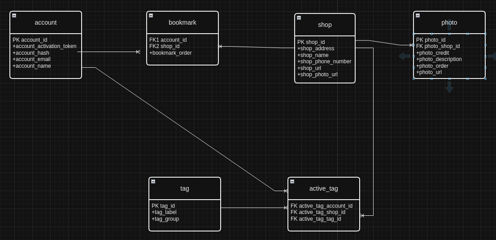

# Conceptual Model

| account                  |
|--------------------------|
| *PK* account_id          |
| account_activation_token |
| account_email            |
| account_hash             |
| account_name             |

| shop              |
|-------------------|
| *PK* shop_id      |
| shop_address      |
| shop_alt          |
| shop_name         |
| shop_phone_number |
| shop_url          |

| photo              |
|--------------------|
| *PK* photo_id      |
| *FK* photo_shop_id |
| photo_url          |
| photo_credit       |
| photo_alt          |
| photo_order        |
 

| tag         |
|-------------|
| *PK* tag_id |
| tag_label   |
| tag_group   |

| active_tag       |
|------------------|
| *FK1* shop_id    |
| *FK2* tag_id     |
| *FK3* account_id |

| bookmark         |
|------------------|
| *FK1* account_id |
| *FK2* shop_id    |
| bookmark_order   |

[Draw.io file](./ERD.drawio)